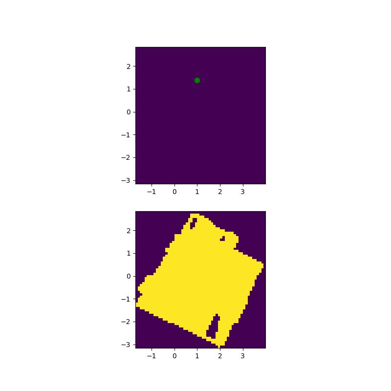
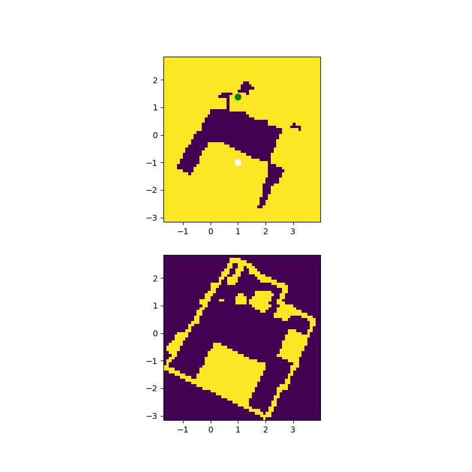

# Navigation Module
This directory contains all the code related to navigation part of the project. It mainly contains following stages
* **Loading Voxel Map:** Initially, given a r3d file of 3D scan it computes the semantic representation of the scene and stores in `cfg.cache_path`directory.
* **Generating Pointcloud:** To properly visualize the path, pointcloud is generated from r3d file and stored in `cfg.pointcloud_path`
* **Object Localisation:** Using the semantic map created with voxel map we extract the most similar point in the scence with the clip embedding of the natural language query.
* **Path Computation:** Once we have the localized point we use A* algorithm with custom weights we generate a path to apporach the point.

When `path_planning.py` is run all the above stages happen sequentially.

Some important arguments in `path_planning.py` include:
* `cfg.cache_path`: representation of the scene and semantic memory storing location.
* `cfg.dataset_path`: path of record3D file.
* `cfg.memory_load_device`: process uses this device to run segmentation model and fetch semantic memory of the scenes.
* `cfg.path_planning_device`: process uses this device to localize objects when running A* path planning.
* `cfg.debug`: set to True if you want to just dry run text query localization, otherwise the process will listen to the robot for the robot starting coordinates.
* `cfg.save_file`: path to save 2D obstacle map and A* paths for each text query.
* `cfg.min_height`: VERY IMPORTANT FOR PATH PLANNING, set to a value 5-10 cm higher than floor height.
* `cfg.pointcloud_visualization`: set to True if you want to visualize planned paths and target objects in a 3D pointcloud, otherwise 3D pointcloud visualization will be disabled. (we recommend you disable visualization when your machine is not connected to a screen to prevent bugs.)

Common bugs: The most common bugs we see happen in A* path planning, the log informantion is 
```
A* planner said that your robot stands on an occupied point,
it might be either your hector slam is not tracking robot current position,
or your min_height or max_height is set to incorrect value so obstacle map is not accurate!
```
This means that the robot starting point is occupied in obstacle map. This might be caused by two reasons:
* Your `cfg.min_height` is set to a low values such that many navigable points are considered as obstacles, when checking in debug mode, the navigation visualization images stored in `cfg.save_file` would be like this:
<p align="center">
  
</p>

* Your robot's lidar SLAM is corrupted. In this case, the robot starting point coordinates are not accurate and the navigation visualization images stored in `cfg.save_file` would be like this, the white starting point falling on yellow obstacle points:
<p align="center">
  
</p>